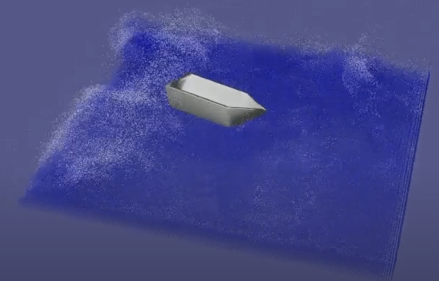

# Simulation of fluid and boat

[**Slides**](https://docs.google.com/presentation/d/1mWwatOpEpbnlOcgtZRYAAADFPcLLoGeM/edit#slide=id.p1) | [**Video**](https://www.youtube.com/watch?v=h50qWqGD4Yk)




## Description
This repo contains implementation of weakly compressible smoothed particle hydrodynamics (WCSPH) approach to simulate the licquide, rigid body and their interaction.

## Installation

### Git and CMAKE
Install cmake:
```
sudo apt-get install cmake
```
or with MacPorts on macOS:
```
sudo port install cmake.
```
On Windows, you can download it from:
[https://cmake.org/download/](https://cmake.org/download/)

### Note for linux users

Many linux distributions do not include `gcc` and the basic development tools in their default installation. On Ubuntu, you need to install the following packages:

```
sudo apt-get install build-essential libx11-dev mesa-common-dev libgl1-mesa-dev libglu1-mesa-dev libxrandr-dev libxi-dev libxmu-dev libblas-dev libxinerama-dev libxcursor-dev
```

If you are using linux with a virtual machine on Windows, it is *recommended* to use **Visual Studio** instead.

### Note for Windows users

`libigl` supports the **Microsoft Visual Studio 2015** compiler and later, in *64bit* mode. You can download *Visual Studio 2019 Community* for free from [here](https://visualstudio.microsoft.com/vs/).

## Building

After you clone our repository run the following commands inside the relevant subfolder to setup the build folder:
```
cd src; mkdir build
cd build
cmake ..
```
On Windows, use the CMAKE gui with the buttons Configure and Generate.

Compile and run the executable, e.g. Ubuntu:
```
make && ./1-1_cannonball/1-1_cannonball
```

## Usage

The main code for the simulation is here: [`CannonBallSim`](src/1-1_cannonball/CannonBallSim.cpp). The data structures and math operations are implemented here: [`include`](src/include). 


